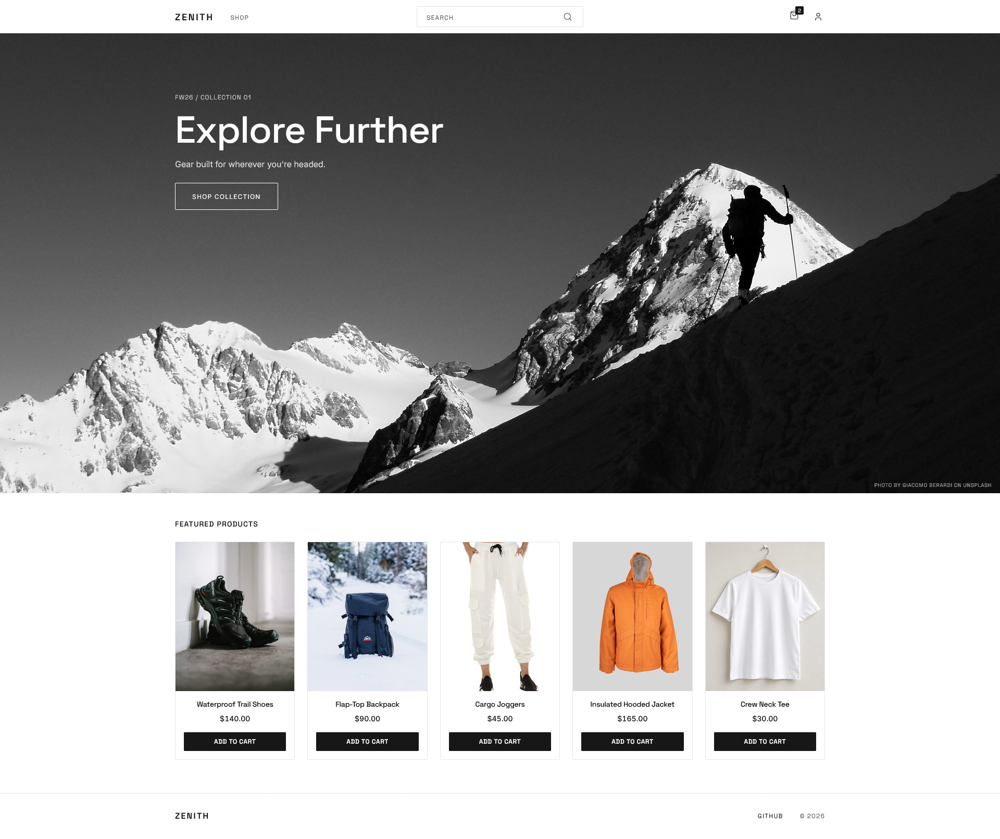

# Zenith

Full-stack e-commerce application built with a React and TypeScript frontend, an ASP.NET Core API, and a PostgreSQL database. Stripe Checkout for payments.

🔗 **[Live Demo](https://ecommerce-app-plum.vercel.app/)**



## Features

- Browse products with category filters, search, and sorting
- User registration and login with JWT authentication
- Add items, adjust quantities, remove items from a cart
- Checkout and payment through Stripe
- Order history and order detail pages
- Admin panel with CRUD operations for categories and products

## Technologies

- **Frontend:** React, TypeScript, Vite, React Router, Axios
- **Backend:** ASP.NET Core, Entity Framework Core, C#
- **Database:** PostgreSQL
- **Payments:** Stripe Checkout
- **Testing:** Vitest, React Testing Library, xUnit
- **Deployment:** Vercel, Azure App Service

## Demo

You can try the live demo with the following credentials:

```text
email: demo@zenith.com
password: demodemo
```

Admin actions are disabled in demo mode.

## Prerequisites

- [.NET 10 SDK](https://dotnet.microsoft.com/download)
- [Node.js](https://nodejs.org/) 24
- PostgreSQL
- A [Stripe](https://stripe.com) account and the [Stripe CLI](https://stripe.com/docs/stripe-cli)

## Getting Started

### 1. Clone the repository

```bash
git clone https://github.com/jetfuzz/ecommerce-app.git
cd ecommerce-app
```

### 2. Configure the backend

Set up [user secrets](https://learn.microsoft.com/aspnet/core/security/app-secrets) for the backend. The Stripe secret key is available in the Stripe dashboard. The webhook secret is generated by the Stripe CLI and set in step 6.

```bash
cd backend
dotnet user-secrets set "ConnectionStrings:DefaultConnection" "Host=localhost;Port=5432;Database=ecommerce;Username=postgres;Password=<password>"
dotnet user-secrets set "Jwt:Key" "<random string, at least 32 characters>"
dotnet user-secrets set "Stripe:SecretKey" "sk_test_..."
dotnet user-secrets set "SeedAdmin:Email" "<admin email>"
dotnet user-secrets set "SeedAdmin:Password" "<admin password>"
dotnet user-secrets set "SeedUser:Email" "<user email>"
dotnet user-secrets set "SeedUser:Password" "<user password>"
```

`appsettings.json` already contains the non-secret defaults for local development (CORS origin, JWT issuer and audience, frontend URL).

### 3. Create the database

Install the EF Core CLI tool and apply the migrations.

```bash
dotnet restore
dotnet tool update --global dotnet-ef
dotnet ef database update
```

### 4. Run the backend

Trust the ASP.NET Core development certificate if required, then start the API.

```bash
dotnet dev-certs https --trust
dotnet run --launch-profile https
```

The first run seeds the database with sample categories and products, plus an admin account and a regular user account created from the `SeedAdmin` and `SeedUser` secrets.

The API listens on `https://localhost:7017` (and `http://localhost:5281`). Swagger UI is available at `/swagger` in development.

### 5. Run the frontend

In a separate terminal:

```bash
cd frontend
npm install
npm run dev
```

### 6. Forward Stripe webhooks (for local development)

Orders are marked as paid by the Stripe webhook, so checkout only completes if the Stripe CLI is forwarding events to the local API.

In a third terminal:

```bash
stripe login
stripe listen --forward-to https://localhost:7017/api/Webhook --skip-verify
```

Copy the `whsec_...` secret it prints, save it as a user secret, and restart the backend:

```bash
cd backend
dotnet user-secrets set "Stripe:WebhookSecret" "whsec_..."
dotnet run --launch-profile https
```

For payments, use Stripe's test card `4242 4242 4242 4242` with any future expiry and any CVC.

## Running Tests

### Backend tests

```bash
dotnet test backend.Tests
```

### Frontend tests

```bash
cd frontend
npx vitest run
```
